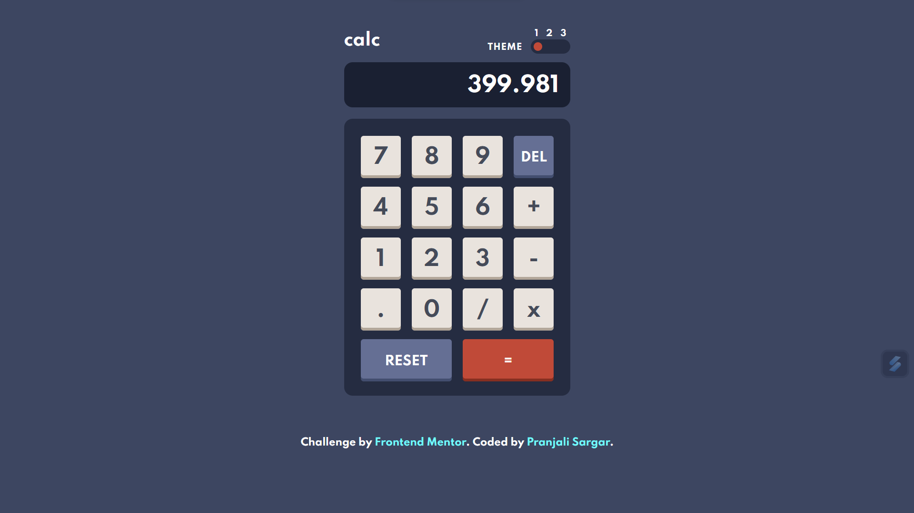

# Frontend Mentor - Calculator App

This is a solution to the [Calculator app challenge on Frontend Mentor](https://www.frontendmentor.io/challenges/calculator-app-9lteq5N29). Frontend Mentor challenges help you improve your coding skills by building realistic projects. 

## Table of contents

- [Overview](#overview)
  - [The challenge](#the-challenge)
  

  - [Built with](#built-with)
- [Author](#author)

## Overview

### The challenge

Users should be able to:

- See the size of the elements adjust based on their device's screen size
- Perform mathmatical operations like addition, subtraction, multiplication, and division
- Adjust the color theme based on their preference

### Links

- Solution URL:[GITHUB](https://github.com/Psargar616/calculator-FrontendMentor)
- Calculator-app-online: (https://calculator-soln-frontend-mentor.netlify.app/)

### Built with

- HTML5
- Tailwindcss
- JS

## Author

- Frontend Mentor - [link](https://www.frontendmentor.io/profile/Psargar616)
